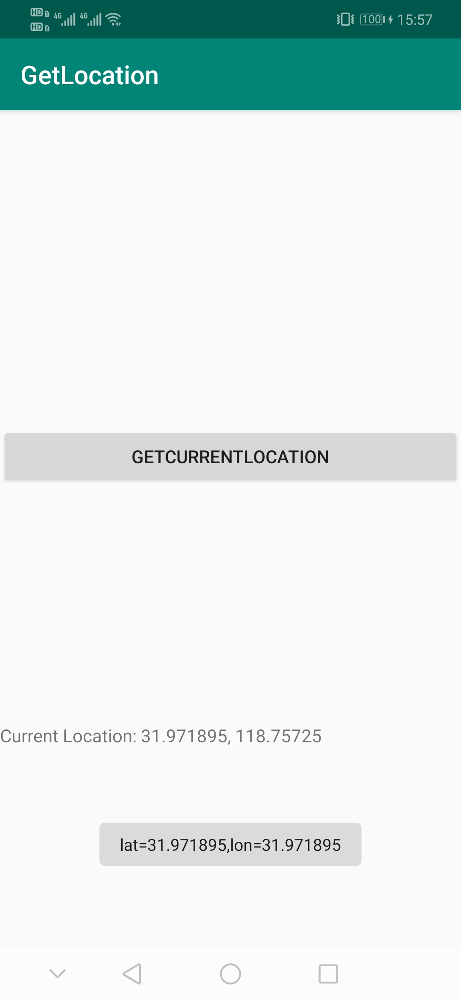

# 如何获取GPS的经度纬度


1. 权限

* LocationManager\GetLocation\app\src\main\AndroidManifest.xml

```
<uses-permission android:name="android.permission.ACCESS_FINE_LOCATION"/>
<uses-permission android:name="android.permission.ACCESS_COARSE_LOCATION"/>
<uses-permission android:name="android.permission.INTERNET"/>
```


2. 在MainActivity中，implements LocationListener及其4个方法
* onLocationChanged()
* onProviderDisabled()
* onStatusChanged()
* onProviderEnabled()


3. 在locationManager.requestLocationUpdates()中，设置gps更新条件

```java
//* @param minTime minimum time interval between location updates, in milliseconds
//* @param minDistance minimum distance between location updates, in meters
```

这里设置为

```java
locationManager = (LocationManager) getSystemService(Context.LOCATION_SERVICE);
locationManager.requestLocationUpdates(LocationManager.GPS_PROVIDER, 5000, 5, this);
```

* 5s更新一次
* 或者移动距离大于5m更新一次


4. LocationListener中最重要的回调方法onLocationChanged

```java
    @Override
    public void onLocationChanged(Location location) {
        TextView locationText = findViewById(R.id.locationText);
        locationText.setText("Current Location: " + location.getLatitude() + ", " + location.getLongitude());
    }
```


5. 满足条件3时，在4的函数中，就能获取到具体的经纬度


6. 最终程序运行截图




