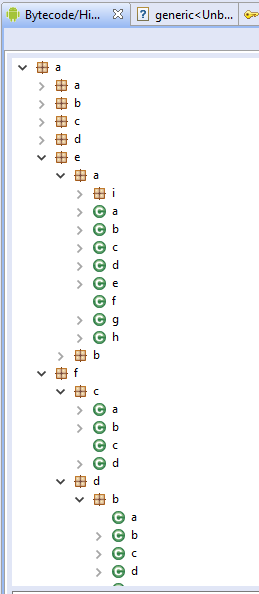

# 如何使用Proguard对APK做代码混淆


Android Studio自带Proguard支持，直接在Android Studio的`build.gradle(Module:app)`中，加入如下配置，即可实现最简单的代码混。

```
    buildTypes {
        release {
            // Enables code shrinking, obfuscation, and optimization for only
            // your project's release build type.
            minifyEnabled true

            // Enables resource shrinking, which is performed by the
            // Android Gradle plugin.
            shrinkResources true

            proguardFiles getDefaultProguardFile('proguard-android-optimize.txt'), 'proguard-rules.pro'
        }
    }
}

```


注意，要编译为release版本，混淆才生效。


混淆后的APK用JEB打开效果如下



